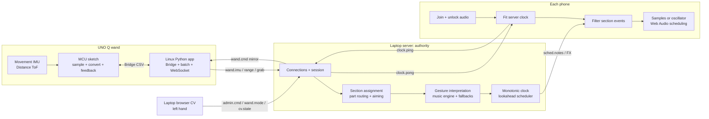
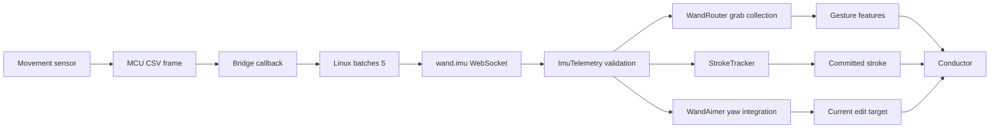
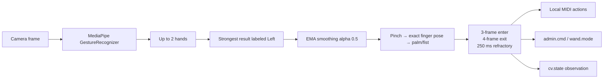

# Phoneharmonic Hardware Architecture and Demo-Defense Guide

This document describes what the current repository actually implements. It distinguishes working code from automated verification, protocol-only verification, hardware-unverified paths, and future scaffolds.

## Verification labels

- **CODED** — present in the current source code.
- **TESTED** — exercised by an automated test run during this audit.
- **PROTOCOL-TESTED** — previously exercised with simulated WebSocket clients or an isolated server, but not with the physical UNO Q and final phones.
- **HARDWARE-UNVERIFIED** — the code exists, but this workspace did not have the physical board, sensors, phones, or final hotspot available for verification.
- **SCAFFOLD ONLY** — placeholder or protocol support exists, but the feature is not active in the current UNO Q application.

## Direct answer: does the UNO Q MCU route phones?

**No. Neither the UNO Q MCU nor its Linux application performs phone assignment or music routing.**

The ownership is:

1. **UNO Q MCU:** samples the Movement and Distance sensors and drives optional LEDs/buzzer.
2. **UNO Q Linux:** converts Bridge callbacks into WebSocket messages and mirrors server state back to the MCU.
3. **Laptop server:** creates phone section IDs, assigns instruments, maps musical parts to sections, determines wand aim, interprets gestures, and creates scheduled note events.
4. **Phone browser:** receives a broadcast batch, keeps only events addressed to its section or `all`, and schedules local audio.

The file named `phone_select.py` on the UNO Q can be misleading. Its own documentation states that the server makes the selection decision. The helper only stores the `aim` value received in `wand.cmd` and contains an unused method that could request yaw recalibration.

## The accurate 15-second explanation

Phoneharmonic uses the UNO Q as a networked sensor wand, the laptop as the routing, music, and timing authority, and the phones as synchronized audio renderers. The laptop sends future timestamped note events; each phone filters its assigned events and schedules them against its local Web Audio clock.

## The accurate 60-second explanation

> Phones scan a QR code and join the laptop server as orchestra sections. The UNO Q's microcontroller samples raw IMU and distance data; its Linux side batches those readings and forwards them to the laptop over a reconnecting Wi-Fi WebSocket. Separately, a laptop webcam recognizes the conductor's left hand for transport and edit-mode changes. The laptop server owns phone assignment, wand aiming, gesture interpretation, musical decisions, the shared clock, and note scheduling. It sends symbolic note events with absolute future server timestamps rather than streaming live audio or issuing a "play now" command. Each phone estimates the server clock, filters events for its section, converts the server timestamp into `AudioContext` time, and renders the sound locally using downloaded samples or oscillator fallbacks.

## 1. Implemented architecture



### Ownership matrix

| Component | What it actually does | What it does not do | Status |
|---|---|---|---|
| UNO Q MCU | Samples IMU at about 60 Hz, samples ToF at about 10 Hz, converts units, sends Bridge CSV, applies optional LED/buzzer state | Phone assignment, routing, aiming, gesture classification, music, synchronization | CODED; HARDWARE-UNVERIFIED |
| UNO Q Linux | Receives Bridge callbacks, batches IMU frames, discovers/reconnects to laptop, sends wand messages, mirrors `wand.cmd` | Musical routing, authoritative selection, active on-device AI | CODED; parser/batching logic tested off-board; full board path HARDWARE-UNVERIFIED |
| Standalone CV page | Recognizes physical-left hand, drives local MIDI controls, sends transport/mode messages, reports debounced state | Raw wand sensing, server-side selection, music routing | CODED; TESTED with pure JS tests; camera use HARDWARE-UNVERIFIED |
| Laptop server | Owns session, sections, routing, aim, gesture processing, music state, model fallbacks, clock, scheduling | Physical phone output latency | CODED; software/protocol paths tested |
| Phone section | Unlocks audio, estimates clock, filters events, loads samples, synthesizes/schedules sound | Global routing or musical decisions | CODED; software/protocol paths tested; final audible multi-phone run HARDWARE-UNVERIFIED |

## 2. Exact phone-routing flow

This entire flow occurs on the laptop and phone clients, not on the UNO Q.

### 2.1 Join and section identity

When a browser connects with `role: "section"`:

1. The server accepts its persisted `client_id` or creates a new one.
2. `_bind_section` reuses the client's previous section when possible.
3. Otherwise, the server creates a new ID such as `s1`, `s2`, or `s3`.
4. The server assigns the least-covered instrument that exists in the current song.
5. If no real song instruments are available, it uses a generic instrument rotation.
6. The `welcome` message contains the section ID and instrument.

**Owner:** laptop `SessionState` and `App._bind_section`.

### 2.2 Part-to-phone routing

For every MIDI part, the conductor uses this priority:

1. **Validated LLM part map**, if one exists: a part index maps to a specific section.
2. **Instrument match:** every phone assigned the part's instrument receives that part. This intentionally allows multiple phones to double a part.
3. **Index round-robin fallback:** if no phone matches the instrument, route by part index across live sections.
4. **`SECTION_ALL`:** when no phone sections exist, events target `all`, allowing the stage/laptop path to render them.

The optional LLM arranger runs on the laptop through Backboard. It is skipped unless configured and unless there are at least two tracks and two phones. A six-second timeout or invalid result leaves the normal instrument-match/round-robin behavior in place.

### 2.3 Broadcast and phone filtering

The scheduler broadcasts the same `sched.notes` batch to all connections with role `section` or `stage`.

Each phone performs:

```javascript
if (event.section === "all" || event.section === mySectionId) {
  synth.schedule(event);
}
```

Therefore:

- the server creates the destinations;
- the network broadcast is shared; and
- the phone enforces the final per-section filter.

## 3. Why UNO Q is a good fit—and the exact claim to make

The official UNO Q architecture combines:

- an STM32U585 Cortex-M33 MCU running the Arduino core on Zephyr;
- a Qualcomm Dragonwing QRB2210 Linux MPU;
- an MCU-to-Linux Bridge/RPC mechanism; and
- Wi-Fi 5 networking.

The project uses that split as follows:

- **MCU:** time-sensitive sensor polling and simple output control.
- **Linux MPU:** Python, files, discovery, JSON, and WebSockets.

This avoids requiring a laptop-side USB serial bridge during the intended live path.

### Safe demo claim

> UNO Q matters because one board combines predictable microcontroller I/O with a full Linux networking environment. We keep sensor sampling on the MCU and protocol/reconnect logic on Linux.

### Claims not to make

- Do not say the UNO Q routes phone parts.
- Do not say the webcam CV runs on the UNO Q.
- Do not say an AI model currently runs on the UNO Q.
- Do not say Wi-Fi discovery has been proven on the final hotspot.
- Do not say the optional feedback hardware is physically working unless it has been wired and observed.

## 4. MCU firmware: what is really implemented

Source: `firmware/uno_q/wand/sketch/sketch.ino`.

### 4.1 Sensor initialization

The sketch constructs both:

- `ModulinoMovement imu`; and
- `ModulinoDistance dist`.

It calls `Modulino.begin()`, `imu.begin()`, and `dist.begin()`.

This proves the **code expects both sensors**. It does not prove both were physically attached and functioning during this audit.

### 4.2 IMU loop

Every `16,667 µs`—approximately 60 Hz—the MCU:

1. calls `imu.update()`;
2. captures `millis()` as wand-local `tw`;
3. multiplies `getX/Y/Z()` by `9.81` to produce m/s² including gravity;
4. leaves `getRoll/Pitch/Yaw()` as raw angular velocity in degrees per second; and
5. sends one CSV record through `Bridge.notify("imu", line)`.

```text
tw,ax,ay,az,gx,gy,gz
```

The MCU does not integrate gyro rate or classify motion.

### 4.3 ToF loop

Every 100 ms—approximately 10 Hz—the sketch:

1. checks `dist.available()`;
2. reads millimetres with `dist.get()`;
3. rejects NaN; and
4. sends the number through `Bridge.notify("range", ...)`.

### 4.4 Reflected state and optional feedback

Linux can send:

```text
playing,mode,aim
```

The MCU parses the values and attempts to drive:

- `LED_BUILTIN`: solid while playing and blinking while paused;
- pin 2: high in deterministic mode; and
- pin 3: a 15 ms buzzer pulse when aim changes to a non-empty section.

The sketch explicitly labels these pins as optional and safe when nothing is wired. Treat this as **code support**, not physical proof.

## 5. UNO Q Linux application

Sources: `python/main.py`, `wand_link.py`, `state.py`, `phone_select.py`, and `ai_mode.py`.

### 5.1 App structure

`main.py`:

1. creates `WandState`, `AiMode`, `WandLink`, and `PhoneSelect`;
2. registers Bridge providers on the main thread;
3. starts the async WebSocket link in a daemon thread; and
4. calls `App.run()` on the main thread so App Lab services Bridge callbacks.

### 5.2 Discovery and reconnection

The connection URL is resolved in this order:

1. explicit `WAND_LAPTOP_IP` or deployed `wand_config.json`;
2. cached last-good WebSocket URL;
3. UDP beacon/probe; and
4. default Linux gateway.

A successful URL is written to `~/.phoneharmonic_wand.json`. The URL survives an app restart. The server-provided `client_id` is retained only in the current Python process; it is not written to that cache file.

The link reconnects forever with a one-second backoff.

**Known deployment caveat:** in the UNO Q application container, the default gateway can be a container/Docker gateway rather than the laptop. The repository's investigation recommends deploying the current laptop IP explicitly for the demo rather than relying on gateway discovery.

### 5.3 Batching and uplink

Bridge callback `_on_imu` parses seven CSV values and appends them to a deque. `_uplink` drains five frames at a time and sends:

```json
{"t":"wand.imu","seq":42,"frames":[[123,0.1,9.7,0.2,1.0,2.0,3.0]]}
```

`BATCH = 5`, so a steady 60 Hz input produces about 12 WebSocket messages per second.

The production deque currently has no maximum length. A sufficiently long disconnect while Bridge callbacks continue could grow memory usage. This is a real hardening item.

### 5.4 Range, tension, and grab

Each new range reading is sent as `wand.range`.

The Linux application also creates hysteretic grab edges:

- below 100 mm → `wand.grab start`;
- above 150 mm after a start → `wand.grab end`.

Separately, the laptop maps raw distance from 600 mm to 100 mm into a global `fx.tension` value from 0 to 1. Because this `fx.tension` message has no section field, all phone sections apply the proximity effect.

### 5.5 Downlink

`wand.cmd` updates the board-side mirror of:

- playing;
- mode; and
- aim.

Linux forwards the mirror to the MCU. It does not use that data to route music.

### 5.6 Scaffold-only files

- `ai_mode.py` is explicitly inert. It loads no model and `infer()` returns `None`.
- `phone_select.py` observes server aim and exposes a recalibration request helper. It does not decide aim, and no current physical button calls `recal()`.

## 6. Wand data flow through the laptop



For every accepted `wand.imu` message, the server:

1. validates the sequence and frame values through `ImuTelemetry`;
2. lets `WandRouter` collect frames if a grab is active;
3. integrates the configured gyro axis into yaw;
4. runs shake detection;
5. runs continuous stroke recognition; and
6. either applies deterministic expression or commits an AI-mode stroke.

## 7. Aiming and selection

### 7.1 Where aiming runs

`WandAimer` runs on the laptop. It integrates the configured gyro channel—default frame index 6, `gz`—using the wand-local timestamp.

The UNO Q receives the resulting section ID later only as reflected feedback.

### 7.2 Phone azimuths

- Manually placed sections use azimuth derived from their stage-map position.
- If no ready section has a nonzero azimuth, the server automatically spreads sections from −60° to +60° by join order.
- `WandAimer` selects the nearest section within 40°.

### 7.3 Select mode is not implemented server-side

The CV one-finger pose sets local mode `SELECT`, but `ServerEmitter` deliberately sends no server-mode message for it.

Therefore:

- wand yaw controls aim continuously;
- one finger does not arm or latch selection; and
- moving the wand during a gesture can change the target.

### 7.4 Shake-to-all

`ShakeDetector` requires four rising crossings of a high acceleration-magnitude threshold inside 600 ms. It forces aim to `None` for 1.5 seconds.

`Conductor.on_aim(None)` also clears all section-specific edit states and folds them back into the shared global state. Shake-to-all is therefore more than a temporary highlight; it resets individual edit overrides.

### 7.5 Known stale-aim ordering issue

In `_update_aim`, a newly committed stroke is sent to the conductor before `engine.on_aim(newAim)` is called for that same batch. After reconnect or a rapid target change, the first stroke can land on the previous aim.

Demo mitigation: point at the intended phone, wait for the aim indicator/downlink to update, and then perform the edit gesture.

## 8. Deterministic mode

The CV two-finger pose sends:

```json
{"t":"wand.mode","mode":"det"}
```

The server:

1. changes the wand session mode;
2. clears any in-progress grab;
3. resets previous expression/tension to neutral; and
4. reflects the new mode to the UNO Q.

Incoming grabs are ignored while the server is in deterministic mode.

### 8.1 Expression mapping

The server uses the last frame's raw `ay / 9.8`, clamped to `[-1, 1]`.

| Active parameter | Mapping | Wire output |
|---|---|---|
| `pitch` | Tilt rounded to seven major-scale steps per octave | `fx.expr {semis, gain:1}` |
| `volume` | Tilt mapped to gain 0.3–1.2 | `fx.expr {semis:0, gain}` |
| `filter` | Inverted tilt mapped to 0–1 tension | targeted `fx.tension` |

The default deterministic parameter is `pitch`. The CV two-finger gesture changes only the mode; it does not choose pitch, volume, or filter. Another controller must send a valid `param` with `wand.mode` to change the parameter.

### 8.2 Important qualification

The code comments call this an absolute tilt coordinate because acceleration includes gravity. The actual implementation uses the latest raw `ay`, not a gravity-only filtered vector. It is most tilt-like while held steadily; linear movement can temporarily perturb the value.

### 8.3 Phone behavior

Targeted phones apply the expression. Every other phone resets to neutral when it receives that targeted message.

The phone's `setExpression` changes master gain and detunes current/future pitched sources. `setTension` closes a low-pass filter and increases compression.

## 9. AI mode and gesture recognition

The CV three-finger pose sends:

```json
{"t":"wand.mode","mode":"ai"}
```

### 9.1 Continuous stroke path

When no grab is active, `StrokeTracker` analyzes a rolling 700 ms IMU window and can commit:

- `LEFT_SWIPE`;
- `RIGHT_SWIPE`;
- `RAISE`;
- `LOWER`;
- `CIRCLE`;
- `STAB`; or
- `SHAKE`.

`STILL` is a status, not a musical stroke commit.

Although the `strokes.py` module docstring still says "display-only," the current `server/main.py` does call `engine.on_stroke()` for a new stroke in AI mode. The executable call site is the authoritative behavior; the docstring is stale.

### 9.2 Grab-window path

When ToF creates a grab:

1. `wand.grab start` opens a server-side window;
2. following IMU frames are buffered;
3. continuous stroke commits are suppressed while grabbing; and
4. `wand.grab end` creates a `GestureWindow` if at least three frames were collected.

Feature extraction produces energy, size, vertical direction, rotation, and duration.

### 9.3 Musical decision path

Both a committed stroke and a released gesture window eventually call the conductor's shared gesture pipeline.

The conductor:

- updates the global or aimed section's musical state;
- asynchronously requests the optional remote decision policy;
- uses a heuristic if no fresh valid policy result is available; and
- can use an optional remote bar-line generator, with deterministic theory candidates when unavailable.

The default `WM_PICKUP` setting is off. Therefore, the main response is normally quantized to the engine's musical scheduling/bar flow rather than guaranteed as an immediate sound effect.

### 9.4 Accurate AI claim

> The laptop can use trained remote models to choose or generate musical material, but synchronization and basic musical response do not depend on those models. Heuristic and theory-based paths remain active.

## 10. Computer vision

### 10.1 Runtime location and dependencies

The standalone CV application runs in a laptop browser, not on the UNO Q.

It imports MediaPipe Tasks Vision 0.10.14 and its model from CDNs. A fresh browser therefore needs internet access unless those resources are already cached.

### 10.2 Recognition pipeline



### 10.3 Gesture mapping

| Gesture | Local standalone-MIDI action | Actual server action |
|---|---|---|
| Open palm | Play | `admin.cmd start` on enter |
| Closed fist | Pause | `admin.cmd stop` on enter |
| Pinch + horizontal movement | Continuous local timeline seek; pauses/resumes local player | One `rewind` or `forward` on release if travel exceeds 0.12 screen width |
| One finger | Set sticky local `SELECT` mode | None |
| Two fingers | Set sticky deterministic mode | `wand.mode det` |
| Three fingers | Set sticky AI mode | `wand.mode ai` |

Server rewind/forward is not continuous scrubbing. The conductor jumps by four bars and reanchors playback if currently playing.

### 10.4 `cv.state` does not control the show

`cv.state` reports the current debounced gesture, sticky local mode, and confidence. The server validates and stores/logs it.

The messages that actually change show behavior are:

- `admin.cmd`; and
- `wand.mode`.

### 10.5 Why it joins as admin

Wand roles share one ownership slot. The server gives physical `role: "wand"` precedence over camera wand roles. The standalone CV page uses `role: "admin"`, so it can control transport and mode without replacing the hardware IMU owner.

### 10.6 Known pinch/fist problem

Pinch classification has priority over the MediaPipe fist label. A fist with thumb and index close together can be recognized as `PINCH`.

Use a clear fist or the on-screen stop control during the demo.

## 11. Phone synchronization

### 11.1 What is synchronized

The server broadcasts events with `at`, an absolute timestamp in milliseconds on the server's process-local monotonic clock.

It does not send a wall-clock time and does not instruct phones to play immediately.

### 11.2 Exact client algorithm

On join, the phone:

1. creates/resumes an `AudioContext` inside the user's tap;
2. attaches the audio clock mapping;
3. sends 10 pings spaced 150 ms apart;
4. sends another ping every 2 seconds;
5. retains up to 80 samples no older than 120 seconds;
6. finds the minimum RTT and keeps samples within 8 ms of it;
7. uses the best offset-only sample until it has at least eight good samples spanning 12 seconds;
8. then fits `serverTime ≈ a + b × performance.now()`;
9. clamps `b` to ±500 ppm; and
10. maps server time through `performance.now()` into `AudioContext.currentTime`.

The performance-to-audio anchor uses the median of five samples and refreshes once per second.

### 11.3 Scheduler values

Current defaults:

- scheduler tick: 100 ms;
- lookahead: 600 ms; and
- minimum lead time: 150 ms.

The scheduler drops events that violate the 150 ms server-side lead requirement. The phone separately drops a note if its mapped time is more than 50 ms in the past; a slightly late note is clamped just ahead of the current audio time.

### 11.4 Why this works

Packets do not have to arrive simultaneously. They only have to arrive before the scheduled timestamp with enough lead for the browser to place them on its audio timeline.

The affine `b` term compensates for clock-rate drift that an offset-only design would accumulate over a longer performance.

### 11.5 Sample rendering

On audio unlock, the synth begins fetching sampled notes from `/assets/sf/`. Those fetches are asynchronous and are not awaited before `section.ready` is sent.

If a sample is still loading, missing, or unsupported, the synth uses an oscillator timbre. Therefore the system does not block note scheduling on a sample download.

This is local rendering after asset retrieval, not live audio streaming from the server.

### 11.6 Device output latency

Clock agreement does not remove different physical audio-output delays. Each phone stores a manual trim value, which is subtracted during server-to-audio time conversion.

Bluetooth speakers should be avoided because their buffering can dominate the remaining synchronization error.

### 11.7 Reconnection

The phone stores its client ID in `localStorage`. On a short reconnect it normally reclaims its existing server section during the 90-second grace period.

The clock client checks the server epoch and retrains if the server restarted or a pong differs from the model by several seconds.

## 12. Music engine and fallback behavior

### 12.1 Main components

| Component | Implemented responsibility |
|---|---|
| `Hub` | Registers clients and concurrently broadcasts by role; closes slow/dead sends |
| `SessionState` | Persists section identity, instrument, placement, volume, and mute |
| `ImuTelemetry` | Validates IMU frames and sequence diagnostics |
| `WandRouter` | Collects grab windows |
| `WandAimer` | Integrates yaw and resolves phone target |
| `StrokeTracker` | Segments continuous hardware motion |
| `Conductor` | Converts musical intent and song parts into scheduled events |
| `RemoteModel` | Optional decision-policy request with heuristic fallback |
| Bar model | Optional generated accompaniment line with deterministic fallback |
| `Scheduler` | Enforces lookahead and broadcasts notes/cancellations |

### 12.2 Timing isolation from AI

MIDI parsing is sent to a worker thread. The LLM arranger uses an executor and timeout. Decision and bar-model clients are designed around cached/asynchronous results.

Consequently, a slow model can delay or remove a model-authored choice, but it should not block the inline clock-pong handler or the scheduler's basic event loop.

### 12.3 Aiming does not solo

Aim chooses where a new edit state or deterministic effect lands. It does not cancel or mute the other musical parts. Every routed part continues unless explicitly muted or changed by its own state.

## 13. Protocol ownership cheat sheet

| Message | Produced by | Consumed by | Effect |
|---|---|---|---|
| `wand.imu` | UNO Q Linux | Laptop server | Validate, aim, collect grab frames, recognize strokes |
| `wand.range` | UNO Q Linux | Laptop server | Global proximity tension |
| `wand.grab` | UNO Q Linux | Laptop server | Open/close AI gesture window; ignored in deterministic mode |
| `wand.cmd` | Laptop server | UNO Q Linux → MCU | Mirror playing, mode, and aim only |
| `admin.cmd` | CV/stage/admin | Laptop server | Start, stop, rewind, forward, and other authorized control |
| `wand.mode` | CV or wand controller | Laptop server | Change AI/deterministic mode and optional deterministic parameter |
| `cv.state` | CV page | Laptop server | Validated observation/logging; no direct show action |
| `section.config` | Laptop server | One phone | Assign section ID/instrument |
| `sched.notes` | Laptop scheduler | All sections/stage | Broadcast future note batch |
| `fx.expr` / `fx.tension` | Laptop server | Sections/stage | Expression processing |
| `clock.ping` / `clock.pong` | Phone/server | Phone/server | Estimate shared clock relationship |

## 14. Verification completed for this rewrite

The following were rerun successfully:

- `server/tools/stream_probe_test.py`: **26/26 passed**.
- `cv_hand_movements/tests/cv.test.mjs`: **9/9 passed**.
- `server/tests/test_strokes.py`: **9/9 printed stroke checks passed**.
- `server/tools/gesture_test.py`: **6/6 gesture-path checks passed**.
- `server/tools/policy_test.py`: **7/7 policy, model, and heuristic-fallback checks passed**.
- `server/tools/midi_test.py`: **4/4 MIDI parsing/playback/shaping checks passed**.
- `server/tools/edit_test.py`: **edit round-trip passed**.
- `server/tools/hum_test.py`: **4/4 hum-to-song checks passed**.

These validate software logic, parsers, telemetry, CV behavior, and synthetic stroke recognition. They do not prove physical sensor values, hotspot connectivity, or audible multi-phone synchronization.

The repository's current investigation report also records isolated protocol-level evidence for section routing, deterministic targeting, start/stop, schedule delivery, and heuristic fallback. Those runs used simulated WebSocket clients, not the final physical setup.

## 15. Known current limitations

| Limitation | Evidence-based impact |
|---|---|
| Physical UNO Q path unverified here | Sensor APIs, Bridge flow, Wi-Fi, LEDs, and buzzer are code claims until run on the actual board |
| Final hotspot unverified | Container gateway discovery, client isolation, IPv4/IPv6, and firewall remain venue risks |
| ToF sensor presence unknown | Current sketch requires/initializes it, but repository inspection cannot prove it is connected |
| Select is local only | One-finger CV does not latch a server target |
| Shake-to-all is temporary and state-resetting | It lasts 1.5 seconds and clears section-specific edit states |
| First-stroke stale aim | Stroke processing precedes same-batch aim update |
| Wand mode resets on owner reconnect | A fresh `WandSlot` defaults to AI mode |
| Pinch precedes fist | Some fists can become pinch |
| Production IMU deque is unbounded | Long disconnects can accumulate frames in memory |
| Samples are not awaited before ready | Early notes may use oscillator fallback |
| Output latency requires calibration | Clock sync cannot measure the final speaker pipeline |
| Intended flagship default MIDI may be absent | Load the demo MIDI explicitly or the built-in fallback may run |
| On-device AI is inert | `ai_mode.py` does not load or run a model |

## 16. Demo-day checklist

- Put laptop, UNO Q, and phones on the same Wi-Fi network, not split between hotspot Wi-Fi and USB tethering.
- Deploy/configure the current laptop IP explicitly on the UNO Q.
- Close duplicate wand/camera/simulator clients.
- Start the laptop server before the UNO Q app.
- Run the standalone CV page as `admin`.
- Join each phone and tap to unlock audio.
- Verify `AudioContext` is `running` and that received/played counters advance.
- Load the intended MIDI explicitly.
- Point and wait for the aim indicator before the first edit after connect/reconnect.
- Reassert deterministic/AI mode after a wand reconnect.
- Test palm start, fist stop, deterministic pitch, AI stroke, ToF squeeze if attached, and shake-to-all.
- Use built-in phone speakers and calibrate trim; avoid Bluetooth.
- Keep on-screen transport and mode controls ready as fallbacks.

## 17. Judge questions with accurate answers

### Does the Arduino route music to the phones?

No. The MCU samples sensors, and the UNO Q Linux side transports those readings. The laptop assigns sections and instruments, maps MIDI parts to section IDs, and timestamps events. Each phone performs the final event filter.

### Why use UNO Q?

It cleanly combines a real-time MCU for sensor I/O with Debian Linux for Python and networking. It removes the need for a laptop-side serial bridge in the intended live architecture.

### Does AI run on the UNO Q?

No. The current on-board `AiMode` class is an inert scaffold. Active decision and bar-generation model calls are made by the laptop server to configured remote endpoints, with deterministic fallbacks.

### Where does CV run?

In the laptop browser through MediaPipe. It sends transport and mode commands as an admin client and does not own the hardware wand slot.

### What synchronizes the phones?

An authoritative monotonic server clock, ping-based affine clock estimation on each phone, a mapping into each `AudioContext`, and 600 ms lookahead scheduling with a 150 ms minimum lead.

### Does WebSocket itself guarantee synchronization?

No. WebSocket transports the data. Absolute future timestamps and local audio scheduling create synchronization.

### Is audio streamed from the laptop?

Not as a live performance stream. Phones fetch sample assets, but note timing and rendering occur locally. Missing/loading samples fall back to local oscillators.

### What happens when AI fails?

The policy falls back to a heuristic and generated material falls back to deterministic theory candidates. Clock synchronization and scheduling are independent of the model response.

### How does the wand choose a phone?

It does not choose on-board. The laptop integrates wand gyro yaw and resolves it against server-owned phone azimuths. The result is mirrored back to the board for feedback.

### What is the biggest remaining risk?

Physical end-to-end validation: the real UNO Q and sensors on the final hotspot, heterogeneous phone audio latency, and a measured multi-phone audible sync test.

## 18. Code evidence map

| Question | Primary source |
|---|---|
| What does the MCU do? | `firmware/uno_q/wand/sketch/sketch.ino` |
| What does UNO Q Linux do? | `firmware/uno_q/wand/python/wand_link.py` |
| Does the board select phones? | `firmware/uno_q/wand/python/phone_select.py` |
| Is on-device AI active? | `firmware/uno_q/wand/python/ai_mode.py` |
| Who creates sections/instruments? | `server/main.py::_bind_section`, `server/session.py` |
| Who routes MIDI parts? | `server/engine/conductor.py::_arrangement_events` |
| What does the optional arranger do? | `server/arranger.py` |
| Who owns aiming and modes? | `server/main.py`, `server/wandio.py` |
| How are continuous strokes recognized? | `server/gestures/strokes.py` |
| How are notes scheduled? | `server/scheduler.py` |
| How does clock sync work? | `web/shared/clock.js` |
| How does a phone filter/render? | `web/section/section.js`, `web/shared/synth.js` |
| How does CV classify/emit? | `cv_hand_movements/cv/`, `main.js`, `net/emit.js` |

## 19. External hardware references

- [Arduino UNO Q official hardware page](https://docs.arduino.cc/hardware/uno-q)
- [Arduino App Lab and Bridge documentation](https://docs.arduino.cc/software/app-lab/)
- [Arduino UNO Q official datasheet](https://docs.arduino.cc/resources/datasheets/ABX00162-datasheet.pdf)
- [IRCAM distributed-audio synchronization paper](https://hal.science/hal-01304889)

## Final architecture sentence to memorize

> The UNO Q is a sensor-and-network gateway; the laptop owns selection, routing, musical intelligence, and time; each phone filters timestamped events and renders its audio locally.
